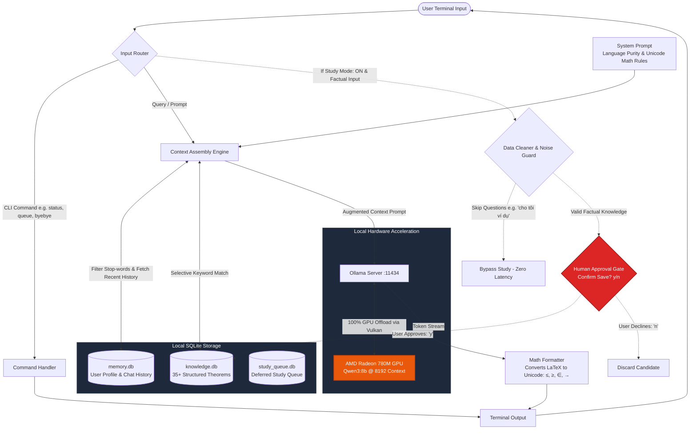
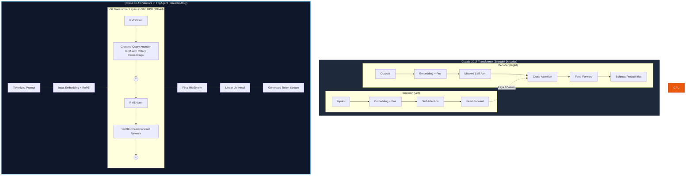

# FogAgent

**FogAgent** is a personal, local-first, offline AI Agent designed to run entirely on local hardware with GPU acceleration, persistent contextual memory, structured knowledge management, human-controlled Study Mode, and strict data quality gates.

---

## 🏛️ System Architecture



---

## 🧠 Underlying Transformer Architecture

FogAgent uses **Qwen3:8b**, an autoregressive **Decoder-Only Transformer** evolved from the seminal *"Attention Is All You Need"* (Vaswani et al., 2017) architecture:



---

## Key Features

- **100% Local-First & Safe:** Powered locally by Ollama with hardware offload on AMD Radeon 780M (Vulkan). Zero internet dependencies, completely private.
- **Human-in-the-Loop & Approval Gate:**
  - Agent **never** silently modifies the knowledge base.
  - Extracted knowledge presents an interactive verification card requiring explicit confirmation (`y/n`).
- **Loop Control & Workload Pre-Estimation:**
  - Automatically estimates processing time on the GPU before analyzing heavy documents.
  - Users can proceed, defer to the **Study Queue** to learn later when the machine is cool, or cancel.
- **Low-Latency Architecture:**
  - **Smart Stop-words Filter:** Ignores conversational fillers (`cho tôi`, `ví dụ`, `tại sao`) during database retrieval to prevent unnecessary SQL latency.
  - **Bypass Double Inference:** Recognizes questions and requests during Study Mode, skipping redundant knowledge extraction calls to keep responses instant.
- **Clean Terminal Math (Unicode):**
  - Converts raw LaTeX markup (`\leq`, `\geq`, `\in`, `\forall`, `\to`, `\infty`, `\times`) into clean Unicode characters (`≤`, `≥`, `∈`, `∀`, `→`, `∞`, `×`) in real-time.
- **Structured Knowledge Store (`knowledge.db`):**
  - Pre-loaded with 35+ verified university-level mathematical theorems (Linear Algebra, Calculus, Sequences, Bolzano-Weierstrass, Rolle, Lagrange).

---

## Project Structure

```text
Fogagent/
├── agent/
│   ├── __init__.py
│   ├── agent.py              # Central Agent coordinating Memory, Knowledge, and Streaming
│   └── study_engine.py       # Knowledge extraction, quality gating & workload estimation
├── config/
│   ├── __init__.py
│   └── settings.py           # Central configuration (model, context, paths, prompts)
├── knowledge/
│   ├── __init__.py
│   ├── data_cleaner.py       # Noise filter, confidence validation, question bypass
│   ├── math_formatter.py     # Real-time LaTeX-to-Unicode math symbol formatter
│   ├── study_queue.py        # Deferred study queue in SQLite
│   └── knowledge_manager.py  # SQLite storage with stop-words search & data auditing
├── memory/
│   ├── __init__.py
│   └── memory_manager.py     # SQLite storage for user facts and conversation context
├── models/
│   ├── __init__.py
│   └── ollama_model.py       # Ollama client with token streaming
├── tests/
│   ├── test_config.py
│   ├── test_agent.py
│   ├── test_memory.py
│   ├── test_knowledge.py
│   ├── test_study_mode.py
│   ├── test_data_cleaner.py
│   ├── test_study_queue.py
│   └── test_math_formatter.py
├── main.py                   # Interactive terminal interface
├── study_math.py             # Controlled math ingestion script with 1-hour watchdog
├── requirements.txt
└── README.md
```

---

## Installation & Setup

### 1. Prerequisites
- Python 3.10+ (tested on Python 3.14 on Windows 11)
- [Ollama](https://ollama.com/) with `qwen3:8b` (accelerated via `OLLAMA_IGPU_ENABLE=1` for AMD Radeon 780M / Vulkan).

### 2. Quickstart
```bash
git clone https://github.com/Titannz/Fogagent.git
cd Fogagent

# Activate virtual environment
.venv\Scripts\Activate.ps1

# Run FogAgent
python main.py
```
*(Shortcut: You can type `fogagent` from anywhere in your terminal).*

---

## CLI Commands

| Command | Category | Action |
| :--- | :--- | :--- |
| `youcanstudy` | Study Mode | Enable Study Mode (allow FogAgent to learn new knowledge). |
| `byebye` | Study Mode | Disable Study Mode (stop learning; retains all learned facts). |
| `queue` | Queue | List all pending study items with estimated processing times. |
| `study_now <id>` | Queue | Process a specific deferred study item from the queue. |
| `queue_drop <id>` | Queue | Remove an item from the study queue. |
| `audit` | Quality | Audit database for duplicate topics and low-confidence entries. |
| `delete <id>` | Quality | Permanently delete a specific knowledge entry by ID. |
| `profile` | Memory | View personalized profile, preferences, and hardware constraints. |
| `remember <k>: <v>` | Memory | Store a user preference or fact into Memory. |
| `memories` | Memory | List all stored persistent memories. |
| `knowledge` | Knowledge | List all learned structured knowledge entries. |
| `status` | System | Display model name, GPU offload, and record counts. |
| `exit` / `quit` | System | Exit the CLI. |

---

## Running Tests

Run the complete 28 automated unit tests:
```bash
python -m unittest discover -s tests -p "test_*.py" -v
```

---

## Roadmap

- [x] **Phase 1:** Ollama + Qwen3:8b GPU Acceleration (AMD Radeon 780M / Vulkan).
- [x] **Phase 2:** Modular Agent Architecture & Streaming CLI.
- [x] **Phase 3:** Persistent Local MemoryManager (`memory.db`).
- [x] **Phase 4:** Structured SQLite KnowledgeManager (`knowledge.db`).
- [x] **Phase 5:** Controlled Study Mode Learning Engine (`youcanstudy` / `byebye`).
- [x] **Phase 6:** Data Quality Pipeline, Loop Control, Workload Estimator & Study Queue.
- [x] ~~**Phase 7:** Autonomous Web Researcher (Removed for safety & offline integrity)~~.
- [ ] **Phase 8:** Secure Local Tools (Deterministic local scripts with human verification).
- [ ] **Phase 9:** Autonomous Planning & Task Decomposition DAG.
